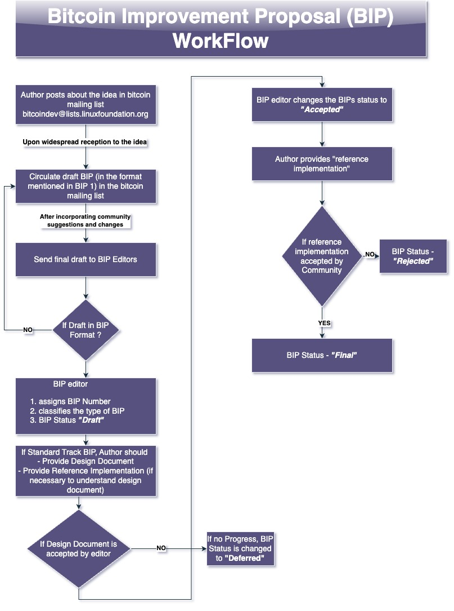

A design document providing information describing a new feature for bitcoin or its processes or its environment. 

BIPs are the primary mechanism to 
- propose new features for bitcoin
- collect community input on an issue
- document the design decisions involved in the feature
- build consensus within the community
- document dissenting opinions
BIPs purpose and guidelines regarding the BIP are detailed in BIP 1[^1]. 
#### Types of BIPs
1. Standard Track BIP are of the following nature
	- intend to change the nature of the network protocol
	- intend to change block (or) transaction validity rules
	- Intend to add features that affect the interoperability of applications using Bitcoin 
2. Informational BIP are of the following nature
	- describes a bitcoin design issue
	- provides general guidelines or information 
	- doesn't propose new feature
3. Process BIP are of the following nature
	- intends to change processes surrounding bitcoin 
	- implementation of process BIPs are typically not on the Bitcoin codebase
Not all new features related to improvement of bitcoin needs to go through the BIP process. BIPs are required to pilot feature addition that require the entire ecosystem to converge on the standard (or) specifications of the feature[^2].
#### BIP Workflow

The roles and responsibilities of the BIP editors are detailed in [BIP 2](BIP%202.md)
# References

[^1]: https://github.com/bitcoin/bips/blob/master/bip-0001.mediawiki
[^2]:  https://bitcoin.stackexchange.com/questions/112406/why-have-a-bip-process-at-all-why-should-we-store-bips-in-a-single-repo/112407#112407