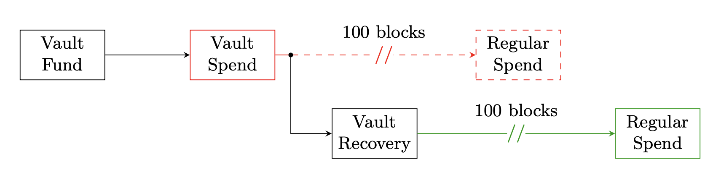

Covenants are a special contract in property law whereby the use of the property is restricted for certain purposes. In bitcoin this translates to transactions enforcing restrictions (other than that of ownership) on the composition of subsequent transaction that depend on the parent transaction. The idea was introduced to bitcoin by Greg Maxwell in 2013. 

The scope of operation of the existing script system of bitcoin limits its functionality by limiting the data that the script can access. At present the only data that the script can access are those provided through the input script(ScriptSig) and output program(ScriptPubKey). The process of an opcode analyzing part of the transaction that executes the opcode is called ***Transaction Introspection*** 
At present the conditions on spending that can be enforced by bitcoin's script system are[^1]:
1. Who can spend - by checking for the signature signed using the right private key (OP_CHECKSIG, OP_CHECKMULTISIG)
2. Who + When can it be spent ? - by placing absolute and relative timelocks on transactions (OP_CHECKSIGVERIFY, OP_CHECKLOCKTIMEVERIFY)
Other conditions that can be enforced but not possible in the present state:
1. How much can be spent
2. Where it can be spent to 

The following are some examples of covenants that are possible in bitcoin with addition of new script capabilities. 
#### Example: Distinguished Coins [^2]
Consider a custom opcode `CheckOutputVerify`. It takes three inputs, `output index`, `amount` and `ScriptPattern`. If we encumber an output with this opcode, the spender will be able to spend this output if he is able to provide the correct `index`, `amount` and `ScriptPattern` while spending. Here we are making the script aware of the index, amount and specific script pattern. In the normal case the spender can spend any index in the transaction and any amount in the transaction as long as the signatures are valid. 

#### Example: Vaults[^1]
Vaults are a mechanism to add more security to private key management.

- To secure the funds, the securer transfers the fund into a `vault fund`, an output with spending conditions ***(Covenants)*** that prevent instant transfer of funds by an attacker if the keys of the `vault fund` addresses are compromised. 
- `vault spends` are spending operations from the `vault fund`. It offers two spend conditions
	 1.  Spend to an address with the `normal key` with a delay, say 100 blocks
	 2. Spend to an address with a `recovery key` instantly. 
 - Consider a situation in which the `normal keys` of the `vault fund` are compromised. The attacher will attempt to use the keys and move the funds to his own address. However, this transaction can't be processed immediately as the transaction has to wait for 100 blocks. 
 - The owner of the `vault fund` spots this transaction in the mempool and initiates recovery. The owner uses his `recovery key` and constructs a transaction spending the `vault fund` into his address. Because transactions using the `recovery keys` are processed immediately, the owner can take control of the funds. 
#### Recursive Covenants
Recursive covenants are contracts which use Bitcoin’s consensus rules to enforce that all bitcoins received to the contract can only be spent to the same contract. This would also include any coins sent to the address encumbered by the covenant. 

Example: Writing a contract that enforces the condition that `prevout` and `nextoutput` of the transaction would create a the simplest type of recursive covenant 

#### Apprehensions about Covenants[^3]
- Recursive and general covenant creating capability would taint coins and affect fungibility 
- Increased expressiveness could both create new DoS vectors as well as result in programmers creating unoptimized scripts that use more node resources than necessary.
- Recursive covenants could introduce Turing completeness and halting problems. 
- Expressive covenants, using an expanded script language, could lead to creation of `drivechains` and potentially to loss of user fund and censorship resistance

# References

[^1]: O’Connor, R., Piekarska, M. (2017). Enhancing Bitcoin Transactions with Covenants. In: Brenner, M., _et al._ Financial Cryptography and Data Security. FC 2017. Lecture Notes in Computer Science(), vol 10323. Springer, Cham. https://doi.org/10.1007/978-3-319-70278-0_12
[^2]: Möser, M., Eyal, I., Gün Sirer, E. (2016). Bitcoin Covenants. In: Clark, J., Meiklejohn, S., Ryan, P., Wallach, D., Brenner, M., Rohloff, K. (eds) Financial Cryptography and Data Security. FC 2016. Lecture Notes in Computer Science(), vol 9604. Springer, Berlin, Heidelberg. https://doi.org/10.1007/978-3-662-53357-4_9
[^3]: https://bitcoinops.org/en/newsletters/2022/03/09/#introduction-of-turing-completeness