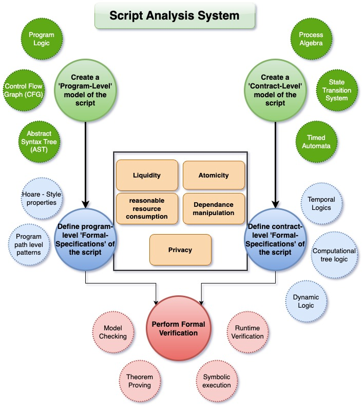
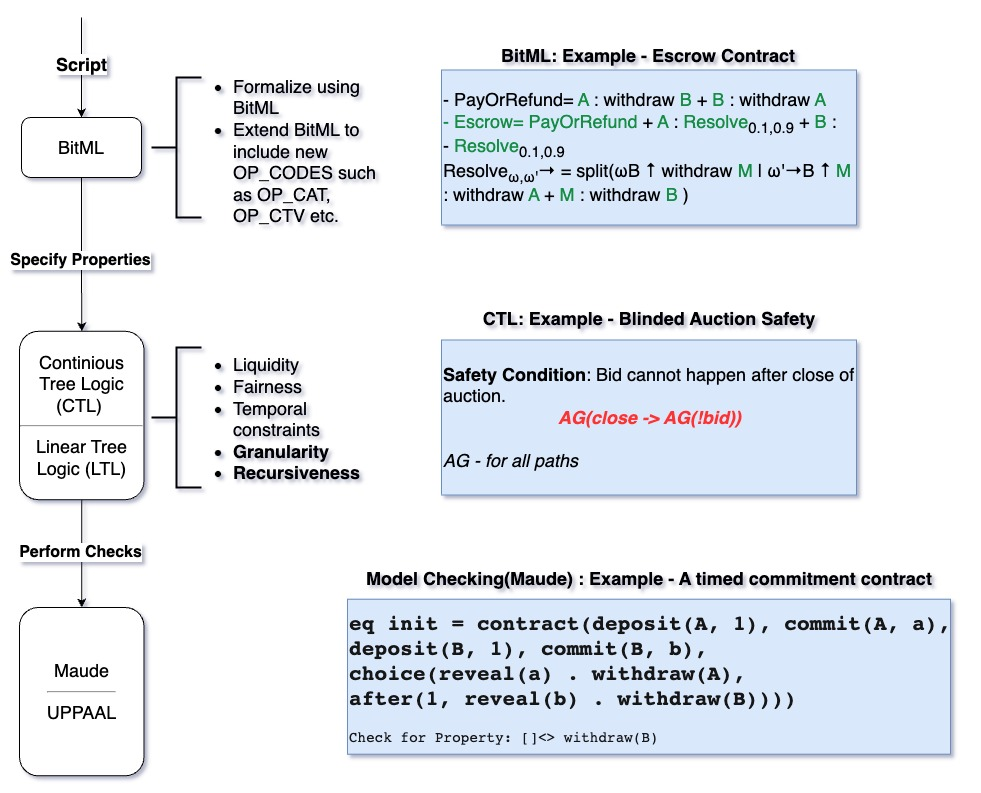

### Framework for evaluating complex bitcoin scripts
#### Problem Statement
Expanding the capabilities of bitcoin via addition of opcodes or otherwise has become a source of debate[^1]. A framework to evaluate the new opcodes and the variety of complex script constructs that they enable will help us progress. These complex scripts are nothing but the encoding of contractual terms and protocol of the involved parties[^2]. Formal analysis of bitcoin scripts can lead to enhanced security of and identify vulnerabilities in the scripts, contracts and covenants. It will be a step in the right direction to identify the ***'unknown unknowns'.*** Currently there exists a lack of tools to specify a script in *Formal* representation so as to make it available for analysis using *formal(mathematical)* models[^2].

#### Literature Survey
*Formal analysis* is the process of creating unambiguous models of bitcoin scripts, expressing their desired properties in *formal* languages such as linear temporal logic (LTL) and using automated tools such as model checkers and theorem provers to rigorously verify these properties. Efforts have been made to introduce formalism to bitcoin scripts[^3]. BitML is a process - algebraic language to write smart contracts. It also has a compiler that translates these contracts into standard bitcoin transactions[^3]. BALZAC (Bitcoin Abstract Language analyzer and compiler) is a formal model and tool chain for bitcoin. It has a *transaction model* that is used to represent low-level details such as how transactions are structured and how they modify the state of the blockchain. It also contains an *endpoint protocol model* that is used to describe how the participants in a contract communicate with each other, observe the block chain and make decisions. Together, the two models help define the rules governing the interaction between participants and implement those rules on bitcoin[^3]. ***Simplicity*** is another typed combinator-based functional language designed to analyze contracts and their implementation in bitcoin scripts. It has formal semantics defined in Coq, that lends itself to formal analysis techniques such as *theorem proving* and *symbolic execution*[^3]. Andrychowicz et.al designed a ***UPPAAL*** based model checker for bitcoin. It creates a network of interacting timed automatas (TA). The desired properties of the contract is specified using temporal logic formulas (Eg. Timed Computational Logic Trees). A model checker takes the TA and TCLT as input and verifies if the contract behaves according to specifications[^4].  It can be observed that significant effort has been made towards formally analyzing bitcoin scripts and contracts. However, to the best of our knowledge, these tools do not lend themselves to analyzing complex scripts and contracts crafted using proposed new opcodes (eg. OP_CAT, OP_CTV etc. ). It is our observation that these tools either perform contract-level analysis or program-level analysis. A hybrid system that can leverage the strengths of both the approach would be a value addition to the formal analysis tool set[^2]. 

#### Proposed script analysis framework
A hybrid system is on that uses both a contract-level model and a program-level model to perform an analysis of the contract, covenant (or) script. 
It is needed due to the increasingly complex script constructions and multi-faceted nature of contracts (or) covenants that can be constructed. Contract-level models are effective in capturing the overall intent and design of the contract, covenant or script.  They provide a *black box* view of the contract, covenant or script by abstracting away the implementation details. However, these models miss implementation details such as fees, opcodes used etc. Program-level models, on the other hand, provide a *white box* view of the contract, covenant or script. They enable low level analysis such as fee consumption, memory management, detecting recursion etc. However, because of their low level nature, they are blind to the state of the block chain and cannot help in analyzing the fairness, liveliness or emergent behavior of the contract, covenant or script. 
We propose a staged approach combining contract-level and program-level models to reason about a contract, covenant or script. 

The proposed analysis framework can be visualized as shown below:

An illustration of contract-level modeling, specification and checking is shown below: 

After specifying the contract (or) covenant in formal language and the properties to check for, they are fed into a model checker. There are many model checkers available and have to be chosen appropriate to the covenant[^2]. The illustration above shows using maude, a frame work based on logic rewriting. The model checking process will examine all the possible execution paths of the contract and raise an error if it finds an execution path where 'B' is never able to withdraw `[] <> withdraw(B)`. 
# References

[^1]: https://shorturl.at/RKWQf.
[^2]: P. Tolmach, Y. Li, S.-W. Lin, Y. Liu, and Z. Li, “A Survey of Smart Contract Formal Specification and Verification,” _ACM Comput. Surv._, vol. 54, no. 7, pp. 1–38, Sep. 2022, doi: [10.1145/3464421](https://doi.org/10.1145/3464421).
[^3]: M. Bartoletti and R. Zunino, “Formal Models of Bitcoin Contracts: A Survey,” _Frontiers in Blockchain_, vol. 2, Aug. 2019, doi: 10.3389/fbloc.2019.00008.
[^4]: M. Andrychowicz, S. Dziembowski, D. Malinowski, and Ł. Mazurek, “Modeling Bitcoin Contracts by Timed Automata,” in _Lecture Notes in Computer Science_, Cham: Springer International Publishing, 2014, pp. 7–22. Accessed: Nov. 27, 2024. [Online]. Available: http://dx.doi.org/10.1007/978-3-319-10512-3_2