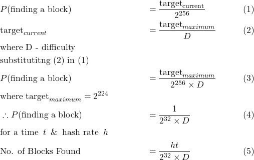
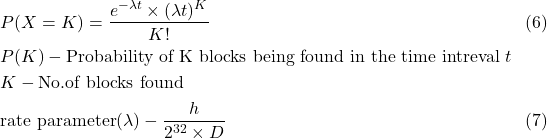
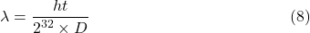
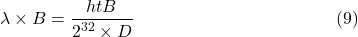
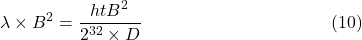
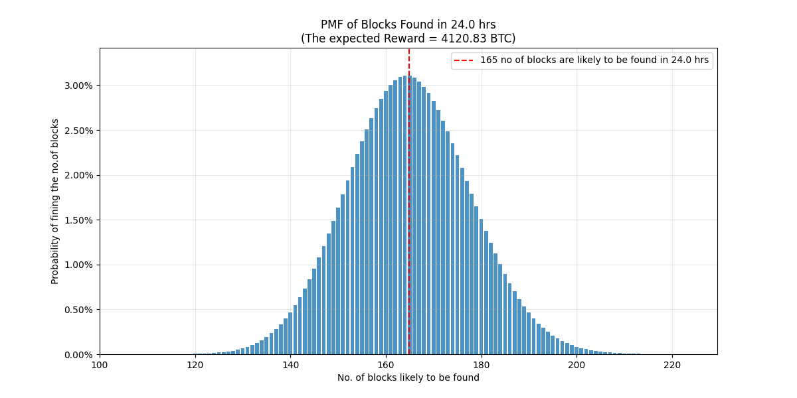
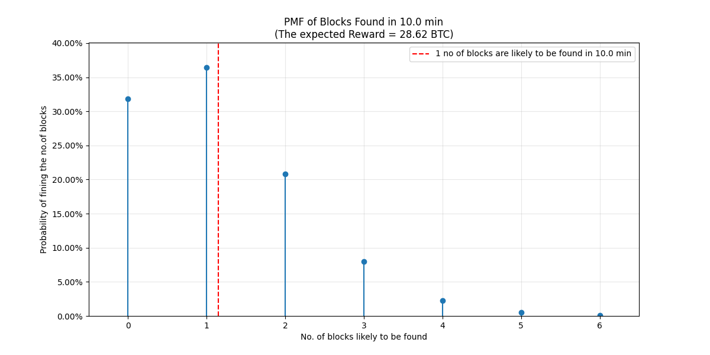
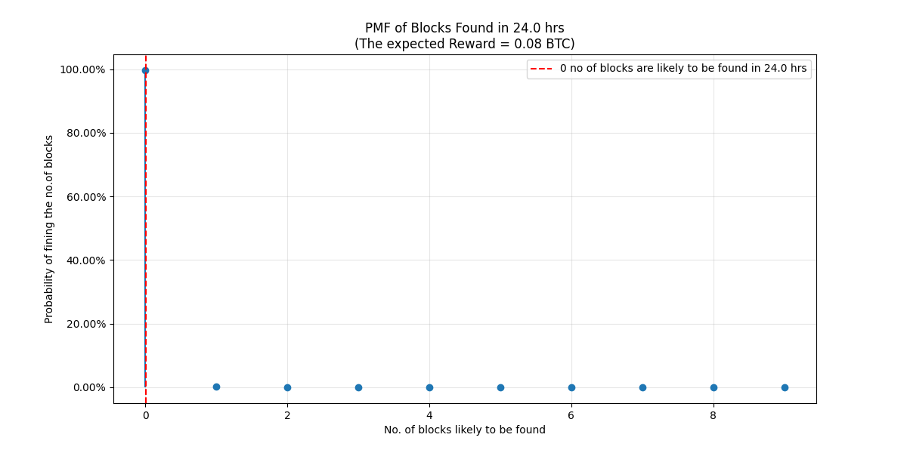

### Understanding the probability of mining a block[^1]
Bitcoin mining is the process of repeatedly computing hashes (double SHA256) of the block header, slightly modified each time, until a hash less than the [target](../Network/Target%20and%20Difficulty.md) is found. Weather a computed hash leads to a block being mined is a ***random event***, independent of the validity of any other calculated hashes.

From the above equations, it can be derived that  miner with hash rate $h$ and mining for a time period $t$ will find $\frac{ht}{2^{32}\times D}$ blocks. 

### Poisson Process
Poisson process is a stochastic process that models the occurrence of random events over time. These events occur continuously and independent of each other. By definition, a poisson process has the following properties. A table illustrating how and why the process of *mining a block* can be understood and analyzed as poisson process is shown below[^2]: 
Event - Finding a $\text{hash}<\text{target}$

| 
S.No
 | 
Poisson property
                        | 
Mining
                                                                                                                                                      |
| --------------------- | -------------------------------------------------------- | ---------------------------------------------------------------------------------------------------------------------------------------------------------------------------- |
| 1.                    | Event occurs independently of each other                 | The event of finding a $\text{hash} < \text{target}$ (a.k.a) finding a block happens independently, (i.e) the previous hash (or) future hash doesn't impact the current hash |
| 2.                    | The average rate of the event remains constant over time | As shown in (5) above, on an average $\frac{ht}{2^{32}\times D}$ blocks are found in a given time intreval                                                                   |
| 3.                    | Two events cannot occur at exactly the same instant      | A miner cannot find two hashes < target at the same time.                                                                                                                    |

The probability mass function (PMF) is given by

For a poisson process, $\text{mean} = \lambda t$  , also $\text{mean}=\text{variance}$. Hence the variance of blocks found by a miner in time $t$ can be expressed as

If the mining reward is assumed to be $B$ BTC per block, the expected reward can be expressed as

the variance in the mining reward received by the miner can be expressed as 

The standard deviation, a measure of the amount of variation a *random variable* $X$ has about its mean, of the mining reward can be expressed, from (10) as

  
 
 The probability that a miner, mining with a constant hash rate of $h$, will ever receive a payment during the time period $t$ can be expressed as
 

 
 
 Understanding the above equations using an example would be helpful. Consider a miner with a constant hash rate of 333 PHs, difficulty of 40.64G, block reward of 25 BTC, for 24 hrs. The Probability mass function (PMF) plot is shown below
 

As can be seen from the plot, the miner has ~ 3% chance of finding 165 no of blocks in 24 hrs. The same miner has  ~35% chance of finding 1 block in 10 minutes. The PMF plot is shown below. 

The variance in the expected BTC reward calculated using (10) for 24 hr period is 103020 BTC. The standard deviation of the expected reward is 320.97 BTC. As can be seen, the miner suffers from quite a large block reward deviation. 

It is to be noted that the hash values used in the above calculations are quite high for a solo miner and are used for illustrative purposes only. 

A realistic hash rate and difficulty would be 180 GH/s & 1.18G respectively. These values are typical of a Antminer S1 ASIC and difficulty during early 2014. On repeating the above calculation for these values, only 0.00306862 blocks will be found in 24hrs (i.e) there is close to a 100% chance of not finding a block in 24 hrs. In fact, it would likely take 326 days to find a block with the hash rate, provided the difficulty remains the same. Such are the odds of solo mining. 

The PMF plot for the above mentioned hash rate and difficulty is shown below. As explained, the probability of finding a block with the hash rate, in 24 hrs, is zero. 

The code to plot the PMF can be found [here](../Mining/pmf.py)
# References

[^1]: Rosenfeld, Meni. “Analysis of Bitcoin Pooled Mining Reward Systems.” _ArXiv (Cornell University)_, 1 Jan. 2011, https://doi.org/10.48550/arxiv.1112.4980.\
[^2]: https://bitcoin.stackexchange.com/questions/43440/why-is-poisson-instead-of-negative-binomial-used-for-computing-attackers-potent