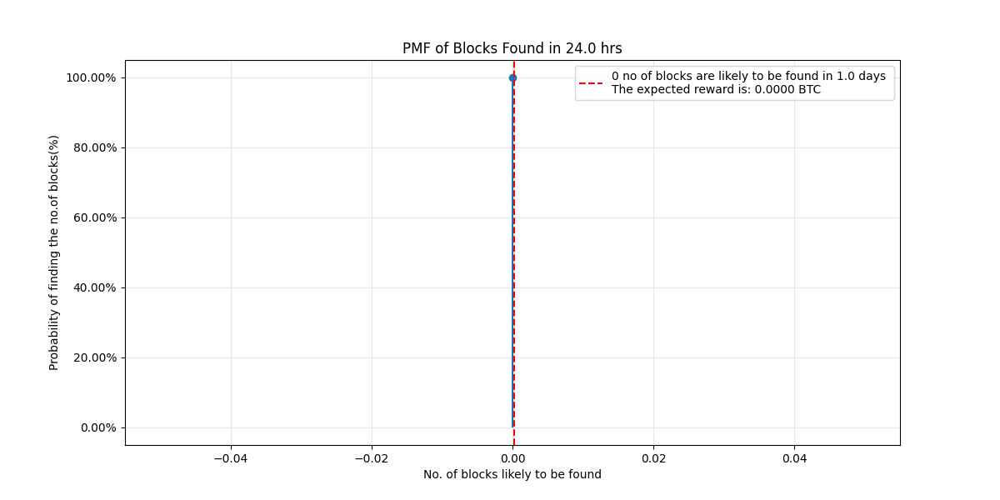

### Understanding the probability of mining a block[^1]
Bitcoin mining is the process of repeatedly computing hashes (double SHA256) of the block header, slightly modified each time, until a hash less than the [target](../Network/Target%20and%20Difficulty.md) is found. Weather a computed hash leads to a block being mined is a ***random event***, independent of the validity of any other calculated hashes.


From the above equations, it can be derived that  miner with hash rate $h$ and mining for a time period $t$ will find $\frac{ht}{2^{32}\times D}$ blocks. 

### Poisson Process
Poisson process is a stochastic process that models the occurrence of random events over time. These events occur continuously and independent of each other. By definition, a poisson process has the properties listed below. An authoritative resource to understand the poisson process in detail would be the text book written by Papoulis[^2]. A table illustrating how and why the process of *mining a block* can be understood and analyzed as poisson process is shown below[^3]:

Event - Finding a $\text{hash}<\text{target}$


| <center>S.No</center> | <center>Poisson property</center>                        | <center>Mining</center>                                                                                                                                                      |
| --------------------- | -------------------------------------------------------- | ---------------------------------------------------------------------------------------------------------------------------------------------------------------------------- |
| 1.                    | Event occurs independently of each other                 | The event of finding a $\text{hash} < \text{target}$ (a.k.a) finding a block happens independently, (i.e) the previous hash (or) future hash doesn't impact the current hash |
| 2.                    | The average rate of the event remains constant over time | As shown in (5) above, on an average $\frac{ht}{2^{32}\times D}$ blocks are found in a given time intreval                                                                   |
| 3.                    | Two events cannot occur at exactly the same instant      | A miner cannot find two hashes < target at the same time.                                                                                                                    |

The probability mass function (PMF) is given by


For a poisson process, $\text{mean} = \lambda t$  , also $\text{mean}=\text{variance}$. Hence the variance of blocks found by a miner in time $t$ can be expressed as


If the mining reward is assumed to be $B$ BTC per block, the expected reward can be expressed as


the variance in the mining reward, a measure of how dispersed the possible mining reward could be around the expected reward (9), can be expressed as 


The standard deviation, a measure of the amount of variation a *random variable* $X$ has about its mean, of the mining reward can be expressed, from (10) as


  
 
 The probability that a miner, mining with a constant hash rate of $h$, will ever receive a payment during the time period $t$ can be expressed as
 

 
 
 Understanding the above equations using examples would be helpful. 
#### Example 1 
Consider a miner with a constant hash rate of 228 EH/s, difficulty of 86.87T, block reward of 3.125 BTC, for 24 hrs. 
- Using (8) and (12), we can calculate that the probability that the miner will mine at least one block and receive a reward, in 24 hrs, is 100 %
- The cumulative distribution function (CDF) of Poisson distribution is defined as: 
``` math
F(k; \lambda) = \displaystyle\sum_{i=0}^k\frac{\lambda^i e^{-\lambda}}{i!}
```
- It gives us the probability of finding less than or equal to a certain number of blocks. Using the expression $1-F(k;\lambda)$ , we can calculate the probability of finding ***at least*** $X$ number of blocks given the hashrate, difficulty and time. This is plotted below
	
- Similarly, using CDF, we can plot the probabilities of finding a range of blocks given the hashrate, difficulty and time. 
	
- The Probability mass function (PMF) of a Poisson distribution is defined as $f(k;\lambda)=\frac{\lambda^k e^{-\lambda}}{k!}$. A plot of PMF vs No.of blocks found provides a clear visual representation of the ***most likely outcome*** given the  the hashrate, difficulty and time. The PMF plot is shown below
 
    
- One can gather the following interpretation from a PMF plot:
	- If the miner were to observe many 24 hour mining data of his, given the mining parameters, he has a 5% probability of having found ~53 blocks. 
	- In a poisson distribution, $\lambda = \text{variance}$. The above example shows a high variance ~53. The number of blocks that the miner is likely to mine in 24 hrs will vary between 45 to 60 blocks. 
The above example is that of a mining pool owning ~30% of the total hash rate (680 EH/s)
#### Example 2
Let us consider another example of a solo miner, owning 10 Antminer S19 Pro, capable of 110 Th/s individually. The difficulty, as on August 2024, is 86.87T and the block subsidy is 3.125 BTC. 
- The probability that the miner will ever mine a block is 0.03%
- The probability of finding ***at least*** X no of blocks is plotted below. It can be seen that no blocks are likely to be found in 24 hours. 
  
- The PMF plot for the given difficulty, hashrate and time period is plotted below. How many ever 24 hour mining window that the solo miner tries, he is certain not to find a block. 
  

The code to plot the PMF can be found [here](../Mining/pmf.py)
# Credits
I would like to thank [Faizal](https://twitter.com/faisal_qrs) for helping with the calculations. 
# References

[^1]: Rosenfeld, Meni. “Analysis of Bitcoin Pooled Mining Reward Systems.” _ArXiv (Cornell University)_, 1 Jan. 2011, https://doi.org/10.48550/arxiv.1112.4980.\
[^2]: Papoulis, A. and Pillai, S.U. (2014) _Probability, random variables, and stochastic processes Athanasios Papoulis ; S. Unnikrishna Pillai_. Boston, Mass: McGraw-Hill.
[^3]: https://bitcoin.stackexchange.com/questions/43440/why-is-poisson-instead-of-negative-binomial-used-for-computing-attackers-potent


