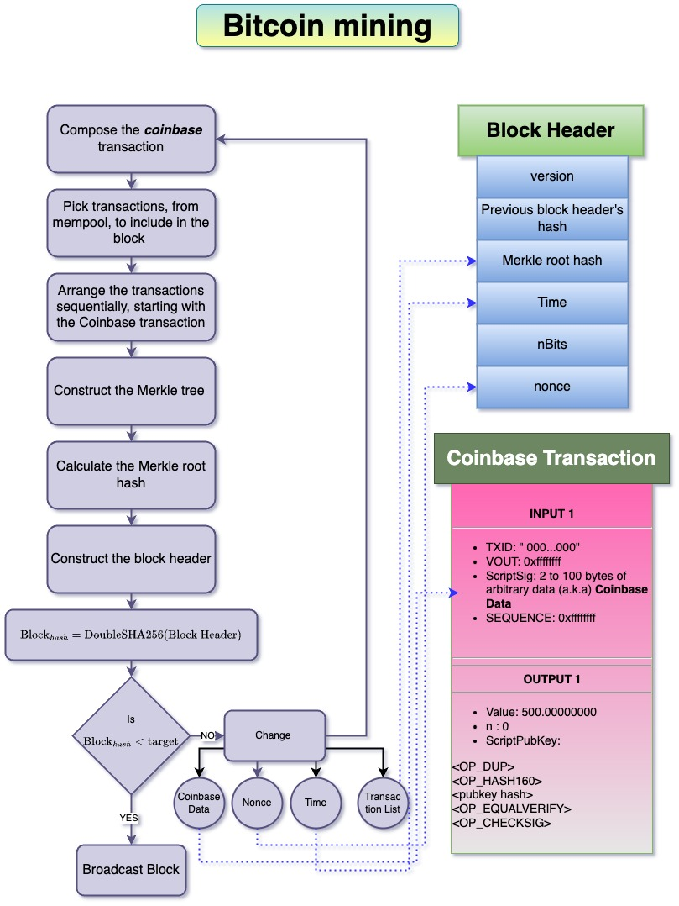

Mining is the process by which the bitcoin network is secured and decentralized consensus(without a central authority) is realized. It incentivizes ***miners*** to secure and facilitate decentralized consensus by awarding them a ***coinbase*** reward. This award also enforces the ***scheduled supply*** of bitcoins. 

### Proof of Work
Miners perform computational work, by expending energy, to enforce security and decentralized consensus of the bitcoin network. This process of expending energy, by performing multiple number of ***double SHA256*** hashes per second, is called proof of work. 
A block is said to be *mined* if the following condition is satisfied[^1]
$$SHA256(SHA256(\text{data} + \text{nonce}))< \text{target}$$
where 
```math
\begin{align*}
&\text{data - block header, except nonce}\\
&\text{nonce - 32 bit unsigned integer}\\
&\text{target - 256 bit unsigned integer}\\
\end{align*}
```
It is the job of the miner to randomly vary `nonce` and perform the hash and check if the hash is less than the [target](../Network/Target%20and%20Difficulty.md)
- Because the nonce is a random number, it is impossible to 'calculate' the right nonce. 
- The only means to find the nonce is to expend the energy to search the 32 bit unsigned integer field to figure out the right `nonce`. 
Once the miner finds the right nonce, the block, comprising the header and transactions, is communicated to the nodes. On receiving the new block, other nodes verify and accept it thereby extending the block chain. The process is illustrated below <br>

# References

[^1]: https://bitcoin.stackexchange.com/questions/148/what-exactly-is-mining