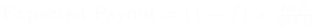
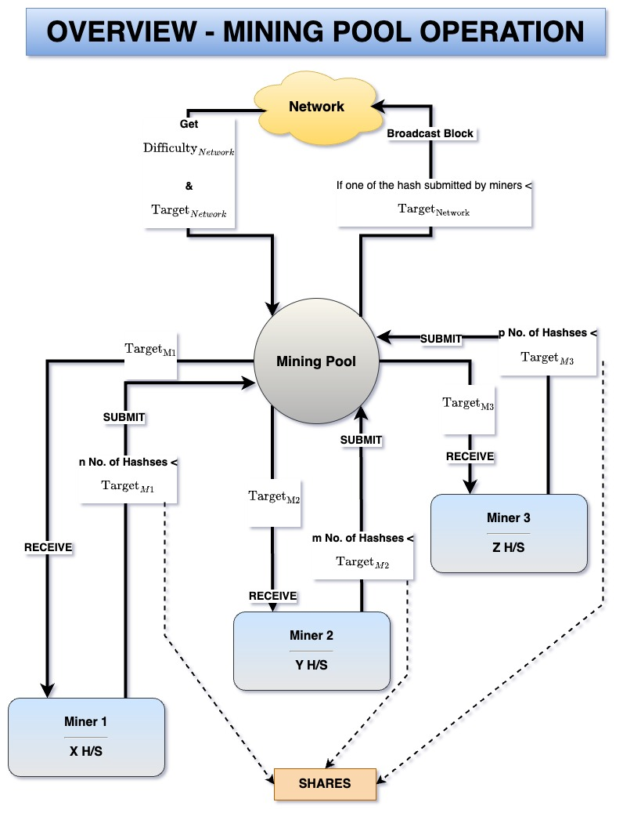

# The probabilities of pooled mining

The process of several miners working together to find a block and splitting the reward (coinbase + transaction fee) in proportion to the hash they contributed is called pooled mining. 

Variance in mining reward refers to the uncertainty in receiving the mining reward over a given period of time. Mining being a [poisson process](Mining%20Probabilities.md)  , the variance of reward received is expressed as $\lambda \times B^2$. 

Let the pool's total hash rate be $H$. Then

Let us consider an individual miner with hashrate $h$ participating in the pool. 

It can be seen from (11), that the variance of the individual miner mining in a pool is a ***fraction*** of that of the variance if he had mined solo. 
### Example
Consider the following parameter with respect to the pool and the miner:

On calculating using equations (1) through (11), we get the following results:

The above results, when plotted as below, underscore that the individual's hash rate, when mining inside a pool, suffers from reduced reward variance. 

The pool, maintained by an operator, typically charges a fixed percentage $f$ of the block reward $B$ for its services. Thus the pool operator receives $f\times B$ for his services. The remaining reward $(1-f)\times B$ is distributed among individual miners, also known as workers. The expected payout for a worker with hashrate $h$ is 

# Shares

In order to measure and quantify the work contributed by individual miners in a pool, the idea of shares is used. A share is a valid hash, double-SHA256(Block Header), that is less than that of the difficulty set by the pool, $\text{pool}_{\text{difficulty}}$ . This difficulty is always less than that of the network's difficulty $\text{Network}_{\text{difficulty}}$. This ensures that the principle of proof of work is maintained in pooled mining as no miner can find a $\text{hash} < \text{pool}_{\text{target}}$ without doing the actual work. The Pool verifies the hashes submitted by the miners to claim their share. 

A basic overview of a mining pool's operation is illustrated below:

The $\text{pool}_{\text{difficulty}}$   thereby the $\text{pool}_{\text{target}}$ that each miner has to satisfy, to earn a share, is set by the pool based on the miner's hash rate. It is a dynamically adjusted value. The faster a miner gets, the lower is the target assigned to him. However, always $\text{pool}_{\text{target}} > \text{network}_{\text{target}}$  . 
### Standardization of Shares

The $\text{pool}_{\text{difficulty}}$  for each contributing miner in the pool, is dynamically adjusted so as to optimize the communication between the pool and the miner. If the difficulty for the miner is too low relative to his hash rate, he will have to communicate frequently with the pool to submit his shares(i.e) hash < $\text{pool}_{\text{target}}$ .
In order to make the share claim by different miners invariant of the dynamically adjusted $\text{pool}_{\text{difficulty}}$ assigned to him, the pool converts the no.of shares at higher difficulties to their $\text{difficulty 1}$ equivalent. 

#### Example

Consider two miners 'A' and 'B' with the same hash rate

| Miner A                                                                            | Miner B                                                                            |
| ---------------------------------------------------------------------------------- | ---------------------------------------------------------------------------------- |
| $\text{pool}_{\text{difficulty}} = 1000000$                                        | $\text{pool}_{\text{difficulty}} = 1$                                              |
| time period = $t$                                                                  | time period $t$                                                                    |
| No. of shares submitted in $t$ = 1                                                 | No. of shares submitted in $t$ = 1000000                                           |
| $\text{difficulty 1 equivalent shares} = 1000000 \times 1 = 1000000 \text{shares}$ | $\text{difficulty 1 equivalent shares} = 1 \times 1000000 = 1000000 \text{shares}$ |

As can be seen from the above example, though both the miners are entitled to the same number of ***equivalent shares***, as they have the same hash rate, Miner 'B' would have communicated 1000000 times more than Miner 'A' to claim his share in time period $t$. 

### The Probabilities of shares

- Each hash of the miner has a probability of $\frac{1}{2^{32}}$ to become a share. 
- Each share of a miner has a probability of $p=\frac{1}{D}$ to become a valid block. 
- If the miner spends this effort, of finding a share($\text{pool}_{\text{difficulty}} < \text{network}_{\text{difficulty}}$), on his own (i.e) solo mining, the reward that he can expect, from the network, is $\frac{1}{D}\times B = pB$ . 
- Instead, if the miner spends this effort in a pool, he will expect $p \times \text{pool}_{\text{reward}}$ , for every share, from the pool. 
- A fair pool will pay the miner $(1-f) \times p \times \text{pool}_{\text{reward}}$ , for every share, where $f$ is the fixed percentage fee that the pool charges for the services rendered.

