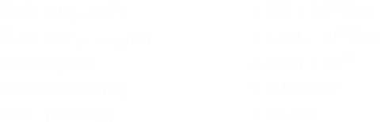

# The probabilities of pooled mining

The process of several miners working together to find a block and splitting the reward (coinbase + transaction fee) in proportion to the hash they contributed is called pooled mining. 
Variance in the mining reward refers to the uncertainty in mining reward over a given period of time. Mining being a [poisson process](Mining%20Probabilities.md)  , variance is expressed as $\lambda \times B^2$

Let the pool's total hash rate be $H$. Then, 

Let us consider an individual miner with hashrate $h$ participating in the pool. 

It can be seen from (11), that the variance of the individual miner mining in a pool is a ***fraction*** of that of the variance if he had mined solo. 
### Example
Consider the following parameter with respect to the pool and the miner:

On calculating using equations (1) through (11), we get the following results:

The above results, when plotted as below, underscore that the individual's hash rate, when mining inside a pool, suffers from reduced reward variance. 

