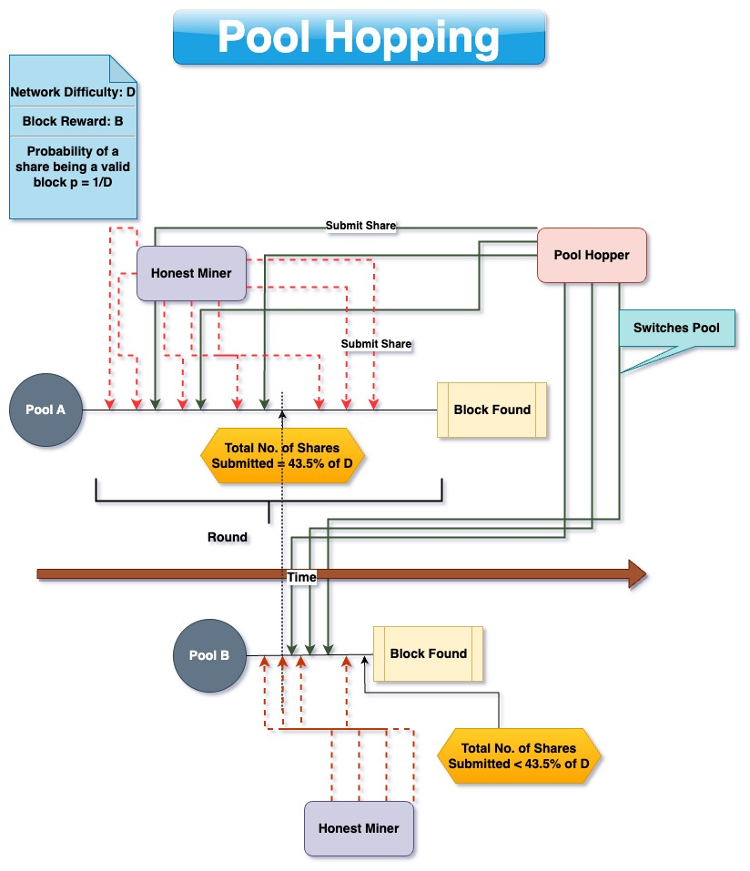

# Reward Systems

The problem of rewarding a miner contributing towards a pool with his [fair share](Pooled%20Mining.md) does not have a trivial solution. 

### Proportional and Pay-Per-Share (PPS) system
Proportional and PPS are the two basic systems to fairly distribute the mining reward among participants in the pool, in proportion to their contributions. 

In a proportional system, the miners mine continuously and submit shares to the pool. The time between the last time the pool found a valid block and the time when the pool finds a valid block is called ***round***. When the pool finds a valid block, a round is said to be completed. If all other miners mining in the pool had submitted $N$ shares and the miner himself has submitted $n$ shares, he is entitled to a proportional reward of $\frac {n}{N}p(1-f)B$ . The miner's variance improves by a factor of $\frac{D}{ln D}$[^1]. 

In a pay-per-share system, the pool operator absorbs all the variance of the individual miner. The miner is guaranteed a steady payout of $p(1-f)B$ . The payout schedule between the pool and the miner is negotiated at the start. 

An illustration of the two systems i shown below:

#### Pool Hopping

In a proportional pool, the miner can earn a reward above his fair share of $\frac {n}{N}p(1-f)B$ by strategically timing when to direct his hash rate towards the pool. This leads to those mining continuously in the same pool to receive less reward than their fair share. 
The expected payout for a newly submitted share depends on the number of shares already submitted in the round. The total number of shares in a round $N$ follows a geometric distribution. From this property, follows the fact that shares submitted at the very start of the round are worth $ln D$ times the normal reward. An illustration of pool hoping is shown below

- When the total no of shares submitted to the pool exceeds 43.5% of the network difficulty $D$, the actual payout that the miner will receive becomes lower than the expected payout, $\frac {n}{N}p(1-f)B$ . 
- The pool hopper switches to another pool when this threshold is reached. 
- The honest miner, who continues to mine with the pool till a block is found, suffers as a result of pool hopping. Because the hash rate of the pool drops, it becomes less likely for the pool to find a block. Worst case, the honest miner can receive 43% less than his expected fair payout. 
# References

[^1]: Rosenfeld, Meni. “Analysis of Bitcoin Pooled Mining Reward Systems.” _ArXiv (Cornell University)_, 1 Jan. 2011, https://doi.org/10.48550/arxiv.1112.4980.\