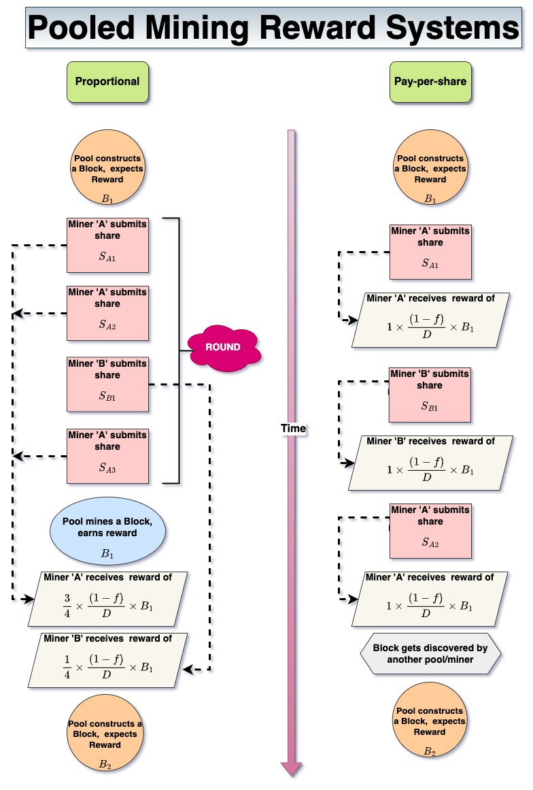

# Reward Systems

The problem of rewarding a miner contributing towards a pool with his [fair share](Pooled%20Mining.md) , $(1-f) \times p \times \text{pool}_{\text{reward}}$ does not have a trivial solution. 

### Proportional and Pay-Per-Share (PPS) system
Proportional and PPS are the two basic systems to fairly distribute the mining reward among participants in the pool, in proportion to their contributions. 

An illustration of the two systems i shown below:

