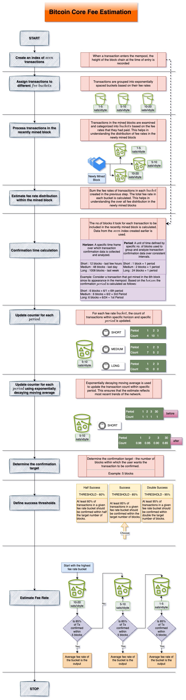

# Transaction Fees
Transaction fees are paid to miners by the person sending the transaction. This fee rewards the miner for his effort towards putting the transaction into a specific order and adding it to a block. 

# Functions of Transaction Fees
1. Protect the network against spam
2. Incentivize the miner to include the transaction in the block that the miner is attempting to mine. 

# Transaction fees estimation 
An illustration of the fee estimation algorithm used by bitcoin core is shown below. 

