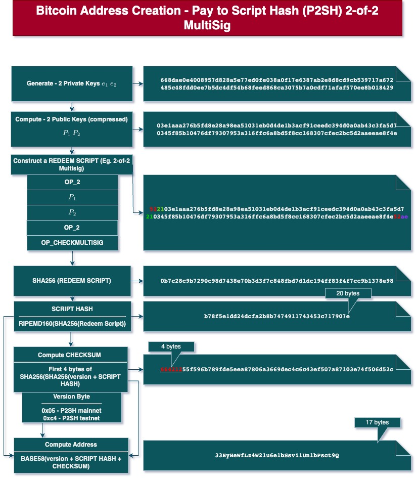
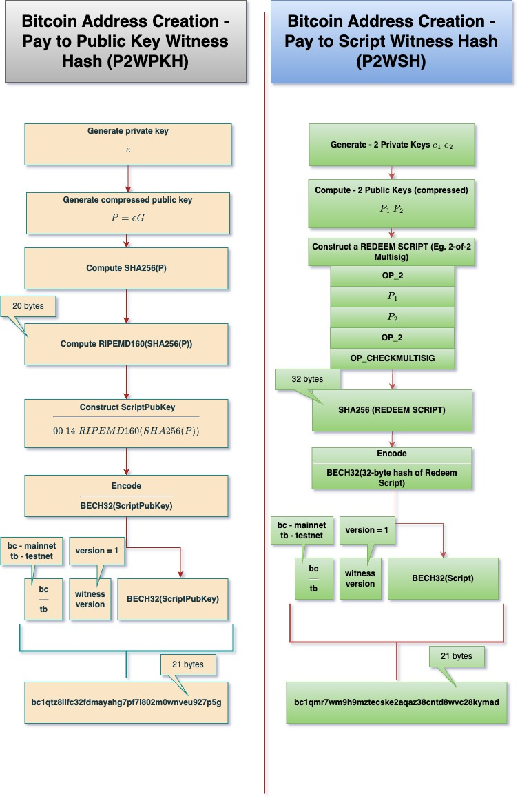

#address
Addresses are easy-to-share format of a locking [[Scripts|script]]. When an address is shared, it means that the receiver is asking the sender to lock the bitcoins that they want to send to the receiver to a specific script pattern. 

#### Versions of address creation
There exists 4 versions of address creation process in Bitcoin. 
1. Version - 1, P2PKH
2. BIP - 13 - P2SH
3. BIP - 173 - P2WPKH
4. BIP - 342 - P2TR

#### P2PKH Address creation process
#p2pkh

#### P2SH Address creation process
#p2sh

#### P2WPKH Address creation process
#segwit #p2pkh

