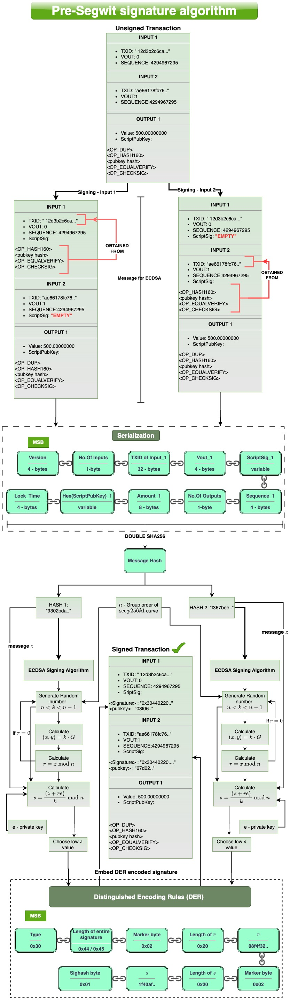
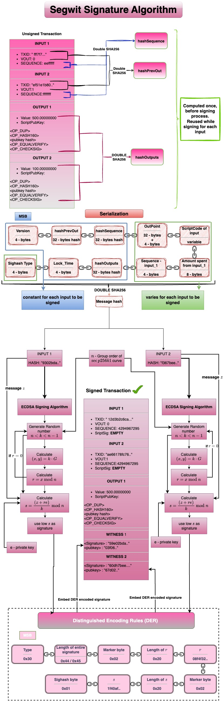

Digital signatures are cryptographic protocols used to ensure that the funds can be spent only by the rightful owner(i.e) holder of the right private key. It is used to unlock outputs that have been locked to a public key hash (or) a script hash. 
#### Pre-Segwit signature creation process  

#### Segwit signature creation process  
