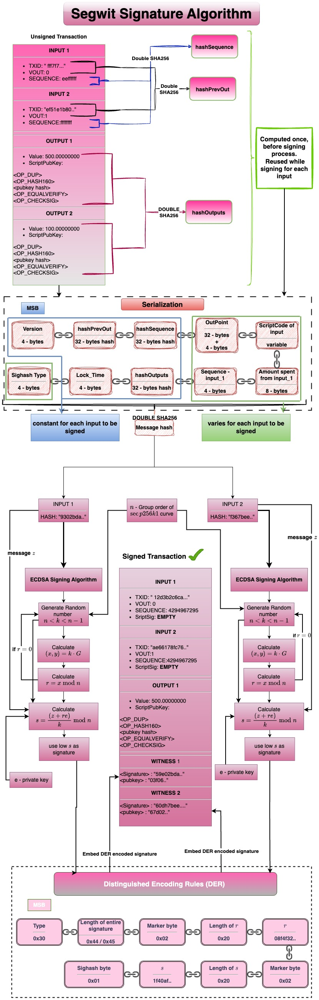

Digital signatures are cryptographic authentication schemes used in bitcoin to 
1. Authorize spending - the rightful owner(i.e) holder of the private key has authorized the spending, without revealing the private key. 
2. Establish that the authorization provided is undeniable. 
3. Ensure others can't change the authorization provided. 
Because bitcoin is a transparent, decentralized, peer-to-peer network, authentication schemes that require centralized store of data and reveal the *secret* while authenticating are not suitable[^1]. 
A signature must be present in the transaction if any one of the following OP Codes are a part of the input's locking script (ScriptPubKey)
1. `OP_CHECKSIG`
2. `OP_CHECKSIGVERIFY`
3. `OP_CHECKMULTISIG`
4. `OP_CHECKMULTISIGVERIFY`
5. `OP_CHECKSIGADD`

### Eliptic Curve Digital Signature Algorithm (ECDSA)
Bitcoin uses ECDSA algorithm to generate signatures. This process uses the [secp256k1](https://en.bitcoin.it/wiki/Secp256k1) curve. The signature algorithm uses the generator point `G`, group order `n` , the private key `e` and the message `z` to produce a pair of numbers `(r,s)` called the signature. This is then encoded according to ***Distinguished Encoding Rules (DER)*** and included in the transaction. The signature creation process is illustrated below.  
### Pre-Segwit signature creation process  

### Segwit signature creation process  
The legacy signature algorithm suffers from the following two issues
1. [Quadratic Sighash Problem](Quadratic%20Sighash%20Problem.md)
2. To compose a transaction it is essential to know the value of the inputs being used. In the context of ***cold wallets*** the following issue exists w.r.t composing a transaction: because the `TxIn` of transactions only consist of the `outpoint` and do not specify the value of the inputs explicitly, it is necessary to supply all supporting transactions along with the one that is to be signed[^2]. This acts as a bottle neck in realizing lightweight, air-gaped cold wallets. If the cold wallet relies on third parties for this information, it adds to the attack vector. 
The segwit upgrade, [BIP 143](https://github.com/bitcoin/bips/blob/master/bip-0143.mediawiki#cite_note-5) introduced a new transaction digest algorithm that is used a the message `z` in the ECDSA process. The process is illustrated below. 

### Transaction's without signature
It is not necessary for a transaction to include a signature for it to be valid. This can be the case when the ScriptPubkey of the input being used does not contain any `CHECKSIG` opcodes. An example of such a transaction can be found [here](https://mempool.space/tx/fdce158d8d9ef51b3fc53d7569f5448ffaa8a28be25992fbb060a36a4715a34c#vin=0)

### References
[^1]: https://bitcoin.stackexchange.com/questions/72842/why-does-bitcoin-use-signatures-to-verify-transactions
[^2]: https://bitcointalk.org/index.php?topic=181734.0