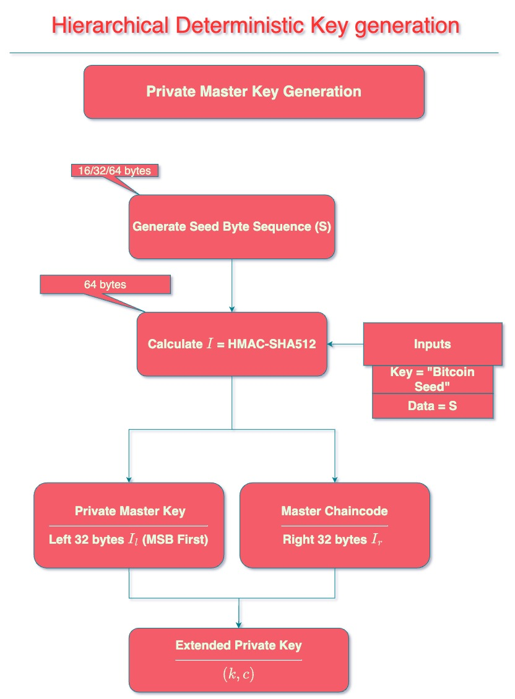

#hdwallet
HD wallets are applications that generate all of its keys and addresses from a single source. 
- Hierarchical - The keys and addresses derived from them can be organized in to a tree
- Deterministic - The keys and addresses can always be derived, from the seed, in the same way. 
## Need for HD Wallets
- Public [[Private Keys|private]] key pairs are central to using the bitcoin network for transfer of funds. 
- It is well established that [[address reuse]] is bad for the privacy of the user and others in the network. [[hash]]
- Using new address to receive funds and change every time is considered as the best practice. 
- Given the best practices, managing ever increasing number of public private key pairs becomes a challenge to wallets. It becomes necessary to backup such a wallet every time a new key pair is generated. Such frequent backups have associated drawbacks. 
- Sharing wallets by maintaining a database of key pairs between systems is very cumbersome as it becomes impractical to update and maintain access to the latest database across multiple instances. 
- Wallets containing database of public private key pairs can't be used to generate only public keys (receive only). 
- Hence the need for an architecture that could derive key pairs from a single source deterministically. 
## Key Generation
#bip32
The process to deterministically generate keys (public/private) from a seed is defined in BIP 32. The BIP specifies how to go from a `16/32/64 byte` seed, stored using [[Mnemonic Seeds|mnemonics]], to a master key and further derive child keys from the master key. 
### Extended Keys
An extended key can be imagined as the root of the tree. From this one can derive children deterministically and construct the branches of the tree. ***4,294,967,296***[^1] such keys can be generated at each hierarchical level. The generated child key can act as the seed for its children. 
#### Types of extended keys
1. Extended private key 
	- Can be used to deterministically generate all child, grandchild etc. private and public keys. (i.e) It can be used to create a complete branch.
2. Extended public key 
	- Can be used to deterministically generate all child, grandchild etc. public keys. 
#### Hash based message authentication code (HMAC)
#hmac
It is a cryptographic message authentication code (MAC) used to simultaneously verify data integrity and authenticity of the message. It can also be used in a key derivation scheme. It is different from digital signatures in that, it facilitates authentication using a *shared secret* rather than using *asymmetric cryptography*. BIP32 uses SHA-512 as the hash function. 
In sum, *HMAC-SHA512 is a function that takes messages of arbitrary length and always produces a 64 byte (or) 512 bits output.*[^4] 

The definition of HMAC is as follows[^3]<br>
$\text{HMAC} (K,D)= H\bigg((K'\oplus opad)\parallel H((K'\oplus ipad)\parallel D)\bigg)$<br>
where<br>
```math \begin {align*} 
	& K \text{ - Key/Secret}\\
	& D \text{ - Data}\\
	& H \text{ - is the hash function. BIP32 uses SHA-512}\\
	& K'=\begin{cases}
		H(K) &\text{if K is larger than block size - 128 bytes for SHA-512}\\
		K &\text{otherwise}
	\end{cases}\\
	& \oplus \text{ - XOR}\\
	& \text{opad} \text{ - 128 bytes of 0x5c - outer padding}\\
	& \text{ipad} \text{- 128 bytes of 0x36 - inner paddind}\\
	& \text{HMAC}(K,D) \text{ - 64bytes code}\\
\end{align*}
```
#### Chain Code
In order to add security to the child key derivation process and to add entropy[^1] to the process, *chaincode* is used. The right 32-byte of the HMAC-SHA512 output of the parent is called the *chaincode*. It is used as the key/secret in the HMAC-SHA512 process. 
Without chaincode, it would be trivial to calculate child public keys, given the parent public key and index `i`[^2]. 

#### Key derivation process[^1]
An overview of the steps involved in the key generation process is shown below

##### Mnemonic Generation 


##### Deriving the Seed from mnemonic phrases


##### Deriving the Master Private/Public Key from the Seed


##### Deriving Private Child Keys from Private Parent Key


##### Deriving Public Child Keys from Public Parent Keys

##### Deriving Public Child Keys from Private Parent Key

## References

[^1]: https://github.com/bitcoin/bips/blob/master/bip-0032.mediawiki
[^2]: https://bitcoin.stackexchange.com/questions/41589/why-is-a-chain-code-needed-for-entropy-in-hd-wallets/41598#41598
[^3]: https://en.wikipedia.org/wiki/HMAC#Implementation
[^4]: https://bitcoin.stackexchange.com/questions/120215/how-is-an-hd-wallet-key-generated?rq=1
