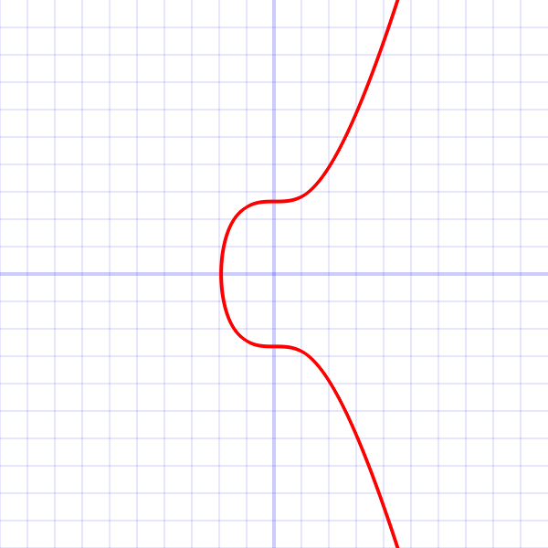

### Elliptic Curve Digital Signature Algorithm[^1]
- Elliptic curve used in bitcoin is called secp256k1
	- The curve's equation is $y^2=x^3+ax+b$ over the FiniteField $F_p$ 
 

- The values of $a$, $b$, $P$, $G$ can be found [here]( https://en.bitcoin.it/wiki/Secp256k1)
- The signature algorithm is called Elliptic Curve Digital Signature Algorithm (ECDSA) 
- In elliptic curve cryptography, the curves are plotted over finite field, rather than over real numbers. 
- The arithmetic used is modulo arithmetic 
#### Public - Private Key Pair [^1]
- $P=eG$
	- $P$ is the public key - (x,y) 256 bit numbers
	- $e$ is the private key - 256 bit random number between `0x1 and 0xFFFFFFFF FFFFFFFF FFFFFFFF FFFFFFFE BAAEDCE6 AF48A03B BFD25E8C D0364140`
	- $G$ is the generator point
- $P$ can be computed if $e$ and $G$ are known
- It is not trivial to compute $e$ if $P$ and $G$ are known (discrete log problem)
- Can we arrive at the same public key point if different private key points are used ?
	- No. Because, in order for $e_1*G = e_2*G$ to be true, $e_1, e_2 = I$, Identity. However, private keys $e$ are finite, 256 bit random numbers. 
#### Signature Creation[^2]
An illustration of the signing process is provided [here](Digital%20Signature.md).
- Generate a random number $k$ $\epsilon$ $[1, n-1]$, $n$ is the order of the curve
- Calculate a Random Point $R = k*G$ 
-  $r$ is the x-coordinate of $R$
- Calculate $s=\frac{(z+re)}{k}$ $(mod$ $n)$
	- $z$ - Hash of the Message
	- $e$ - private key
	- $k$ - Random number
- $(r,s)$ is the signature pair. 
- Use low - $s$ as the signature
#### Signature Verification[^2]
- Bob wants to validate Alice's message. He has the following information 
	- Alice's message hash $z$
	- Alice's signature $(r,s)$
	- Alice's public key $P$
- Calculate the following 
	- $u=z*s^{-1} \hspace{1mm} mod \hspace{1mm} n, v=r*s^{-1} \hspace{1mm}mod \hspace{1mm}n$
	- $uG+vP=O$
- If $r=O_x$ , x-coordinate of $O$, then the signature is valid. 

### Malleability[^3]
- $r=x(\frac{z}{s}*G+\frac{r}{s}*P)$ $mod$ $n$
	- x() means, x - coordinate of 
- In the above equation if we substitute $-s'$ instead of $s$ we get 
	- $r=x(\frac{z}{-s^{'-1}}*G+\frac{r}{-s^{'-1}}*P)$ $mod$ $n$ =  $x(-(\frac{z}{s^{'-1}}*G+\frac{r}{s^{'-1}}*P))$ $mod$ $n$
	- In Elliptic curves, for any point $Q$, $x(Q) = x(-Q)$
 
- Thus a signature $(r,s')$ is a valid signature wherever $(r,s)$ is valid. 
- If we use this complimentary, yet valid signature, we will get a different txid - Malleability 
- To fix, this malleability, a **standardness rule**[^4] was adopted to use only ***low-s*** signatures. Note: This is not a consensus rule.  
# References

[^1]: https://en.bitcoin.it/wiki/Secp256k1
[^2]: https://en.wikipedia.org/wiki/Elliptic_Curve_Digital_Signature_Algorithm
[^3]: https://bitcoin.stackexchange.com/questions/83408/in-ecdsa-why-is-r-%E2%88%92s-mod-n-complementary-to-r-s
[^4]: https://bitcoin.stackexchange.com/questions/114353/how-and-when-were-high-s-signatures-made-non-standard/114354#114354
