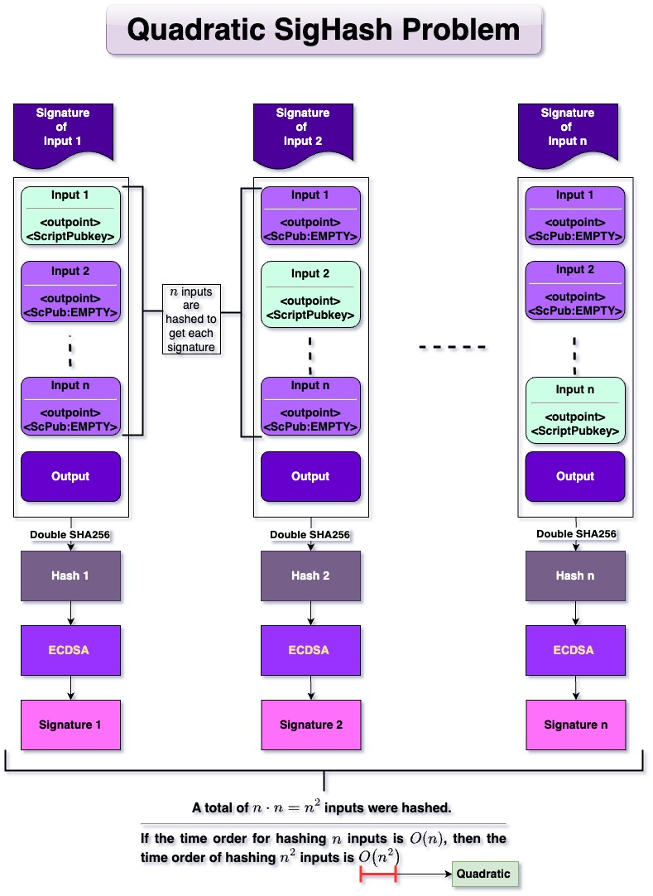
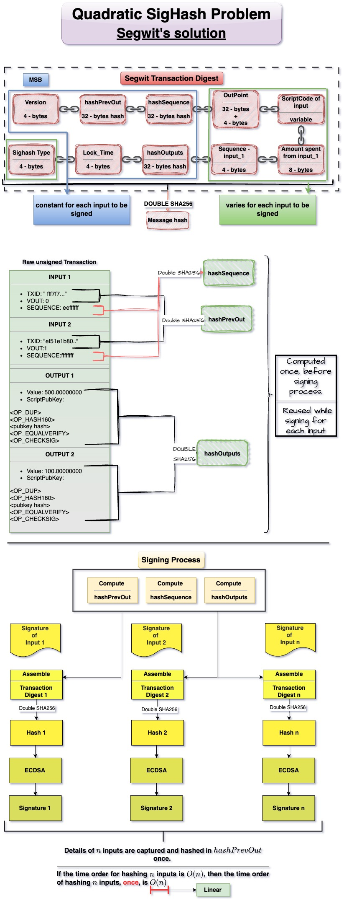

The method to construct the hash of the message $z$ is called the signature hash algorithm (*sighash*). In legacy transactions, pre-segwit, because of the contents of the message $z$ that is signed, it is necessary that $n^2$ hashes have to be performed. Thus the time complexity of the signing process is quadratic $O(n^2)$. The pre-segwit signing process is illustrated [here](Digital%20Signature.md). The quadratic time complexity of the pre-segwit signing process is illustrated below:

### Quadratic order of pre-segwit signing  

### Linear order of segwit signing  
In the post segwit sighash algorithm, hash of PrevOut(`txid , vout` ),  Sequence (`nsequence`) and Output (`Amount, ScriptCode`) are computed and used rather than using them directly. 
- This facilitates computation of the hash before signing / verifying process and reusing the hash while signing / verifying each input. 
- This means, if there are $n$ inputs, inputs (`txid, vout, nsequence`) will be hashed only $n$ times and not $n^2$ times. 
- Thus reducing the complexity of the hashing process from $O(n^2)$ to $O(n)$ 
